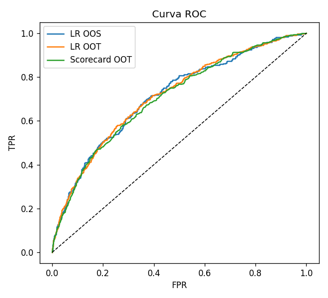
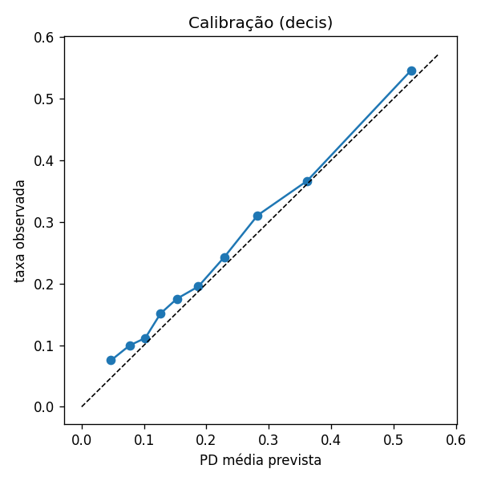
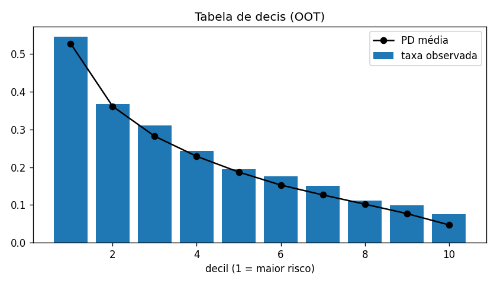
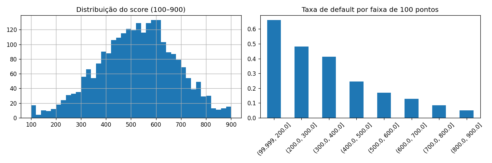
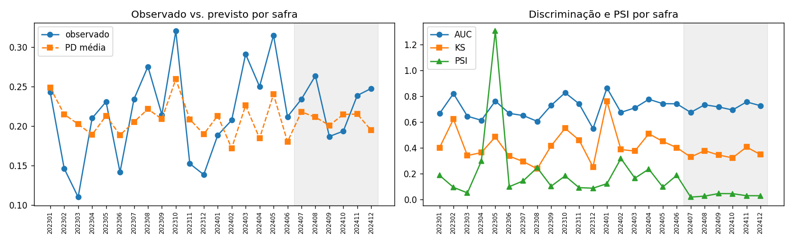
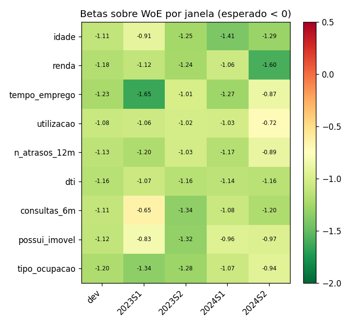
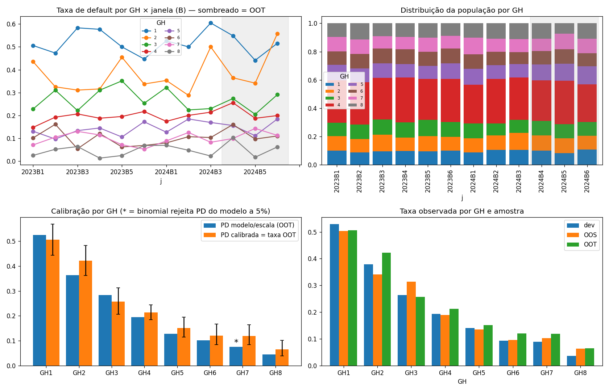
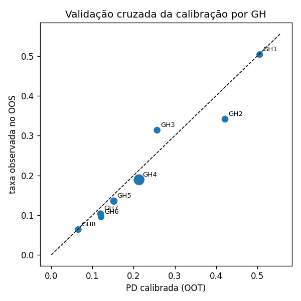
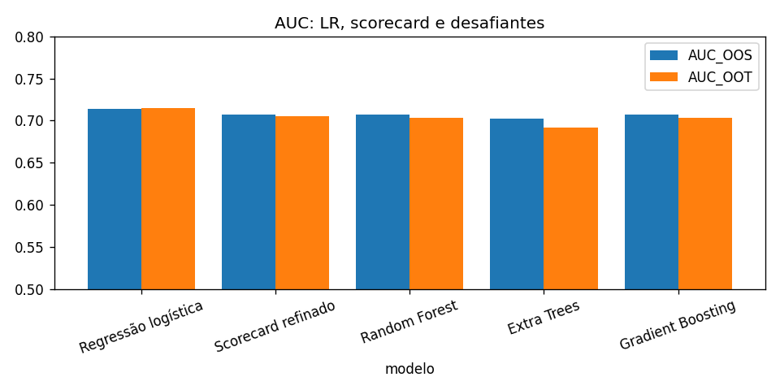

# Modelo de PD — Scorecard

Superintendência de Validação de Modelos — 2026-08-27 — gerado por credpipe (backend LR: sklearn)

<strong>Resumo.</strong> Modelo de probabilidade de <em>default</em> (PD) construído por regressão logística e convertido em <em>scorecard</em> com variáveis categorizadas por <em>Weight of Evidence</em>. Base de 10000 operações (taxa de default 21,580%), dividida em desenvolvimento (5991), <em>out-of-sample</em> (1498) e <em>out-of-time</em> (2511; safras 202407–202412). O refino recursivo de faixas convergiu (convergiu na iteração 3) com 9 variáveis e 32 faixas; a malha de 8 grupos homogêneos é monotônica, sem cruzamento significativo entre janelas (convergiu) e calibrada na taxa observada do OOT. Discriminação do scorecard: AUC 0,707 (OOS) e 0,705 (OOT); Gini 0,410; KS 0,303 no OOT. Regressão logística contínua: AUC 0,714 (OOS) e 0,715 (OOT).

[TOC]

## 1. Objetivo e escopo

O modelo estima $\Pr(Y=1\mid \mathbf{x})$, em que $Y$ indica o evento de <em>default</em> marcado na coluna `default` da base e $\mathbf{x}$ reúne as variáveis declaradas no layout. A safra (`safra`) não é preditor: organiza a divisão temporal e as janelas em que estabilidade é medida. A PD alimenta a perda esperada $EL = PD \times LGD \times EAD$ usada em provisão (IFRS 9 / Resolução CMN 4.966) e em capital (Basileia IRB / Circular BCB 3.648), e por isso o desenvolvimento verifica discriminação, calibração e estabilidade, as três propriedades que a validação independente testa (BCBS, 2005; SR 11-7).

## 2. Base de dados

| item | valor |
|---|---|
| observações | 10000 |
| taxa de default | 21,580% |
| safras | 202301 a 202412 (24 safras) |
| desenvolvimento (treino) | 5991 |
| OOS (in-time, 20% do dev) | 1498 |
| OOT | 2511 — safras 202407, 202408, 202409, 202410, 202411, 202412 |

### 2.1 Variáveis e racionalidade econômica

| variável | tipo | sinal esperado | racionalidade |
|---|---|---|---|
| idade | num | - | Ciclo de vida: jovens têm renda corrente abaixo da permanente |
| renda | num | - | Capacidade de pagamento absoluta |
| tempo_emprego | num | - | Estabilidade de renda |
| utilizacao | num | + | Restrição de liquidez (Gross & Souleles, 2002) |
| n_atrasos_12m | num | + | Persistência de comportamento |
| dti | num | + | Comprometimento de renda |
| consultas_6m | num | + | Busca por crédito / seleção adversa |
| possui_imovel | num | - | Riqueza e colateral |
| tipo_ocupacao | cat | — | Estabilidade da fonte de renda |

Taxa de default por safra (toda a base):

| safra | n | taxa_default |
|---|---|---|
| 202301,000 | 408 | 19,608% |
| 202302,000 | 429 | 19,347% |
| 202303,000 | 421 | 18,527% |
| 202304,000 | 428 | 22,196% |
| 202305,000 | 431 | 22,506% |
| 202306,000 | 447 | 20,134% |
| 202307,000 | 411 | 20,438% |
| 202308,000 | 393 | 22,901% |
| 202309,000 | 436 | 19,954% |
| 202310,000 | 391 | 24,041% |
| 202311,000 | 420 | 21,190% |
| 202312,000 | 425 | 20,235% |
| 202401,000 | 412 | 19,660% |
| 202402,000 | 447 | 20,805% |
| 202403,000 | 397 | 20,907% |
| 202404,000 | 385 | 20,779% |
| 202405,000 | 391 | 25,064% |
| 202406,000 | 417 | 23,741% |
| 202407,000 | 423 | 23,404% |
| 202408,000 | 383 | 26,371% |
| 202409,000 | 391 | 18,670% |
| 202410,000 | 429 | 19,347% |
| 202411,000 | 465 | 23,871% |
| 202412,000 | 420 | 24,762% |

## 3. Metodologia

**Regressão logística.** O <em>log-odds</em> é linear nas covariáveis, $\ln\frac{PD}{1-PD}=\beta_0+\boldsymbol\beta^\top\mathbf{x}$, estimado por máxima verossimilhança com penalidade L2 (ridge) e covariáveis padronizadas; $e^{\beta_j}$ é o <em>odds ratio</em> por desvio-padrão (Hosmer, Lemeshow e Sturdivant, 2013). O hiperparâmetro $C$ foi buscado em 20 configurações otimizando AUC em validação cruzada estratificada de 5 dobras; o modelo original é mantido quando o ajuste não melhora.

**Discriminação e calibração.** AUC (Hanley e McNeil, 1982), Gini $=2\,AUC-1$ (Engelmann, Hayden e Tasche, 2003), KS $=\max_c|TPR(c)-FPR(c)|$, tabela de decis e curva de calibração. Corte de aprovação por F1 e por custo (FN:FP = 10:1).

**Escala de pontos.** $Score = Offset + Factor\cdot\ln(odds_{bom})$, $Factor = PDO/\ln 2$ (Siddiqi, 2017; Anderson, 2007). Modo `faixa_cheia`: Factor = 169,749, Offset = 262,691, PDO implícito = 117,661, limites 100–900.

**WoE, IV e scorecard.** $WoE_j=\ln\frac{n_j^B/N^B}{n_j^M/N^M}$ (positivo = faixa mais segura), $IV=\sum_j(n_j^B/N^B-n_j^M/N^M)\,WoE_j$ (Good, 1950; Kullback e Leibler, 1951). Regressão logística sem regularização sobre as variáveis em WoE; pontos por faixa $=-Factor\cdot\beta_k\cdot WoE_{kj}+(Offset-Factor\cdot\beta_0)/K$. Sob independência condicional os $\beta_k$ seriam todos $-1$; coeficientes positivos contradizem a evidência univariada.

**Refino recursivo (Algoritmo H).** A cada iteração, para cada variável, aplica-se a correção menos destrutiva que resolve a primeira restrição violada, na ordem: IV $\ge$ 0.02 → população mínima por faixa 5% → monotonicidade do WoE (numéricas) → ausência de inversão de sinal do WoE entre dev e OOT → Spearman(WoE dev, WoE OOT) $\ge$ 0.8 → CSI $\le$ 0.1. Só quando nenhuma faixa exige ação testam-se os coeficientes (dev e janelas `S`): beta $>$ 0.0 ou tendência contrária ao `sinal_esperado` descarta a variável (uma por iteração, por multicolinearidade).

**Estabilidade temporal.** PSI do score por safra (Yurdakul, 2018), CSI por variável, correlação de ordenação do WoE e betas reestimados por janela; OOS mede sobreajuste, OOT mede sobrevivência das relações no tempo (Breeden, 2016; BCBS, 2005).

**Malha de GH e calibração.** Grupos homogêneos por quantis do score (10 iniciais), fundidos recursivamente até: taxa monotônica no dev, $\ge$ 20 defaults por GH e nenhum cruzamento significativo (z unilateral, $\alpha$ = 0.1) entre GHs adjacentes em qualquer janela `B` com $\ge$ 30 observações (OOT e dev). A PD de cada GH é a taxa observada no OOT, com intervalo de Jeffreys a 95% e teste binomial contra a PD implícita pela escala; margem de conservadorismo `IC95_sup`.

## 4. Regressão logística

### 4.1 Validação cruzada

| Fold | Accuracy | AUC | Recall | Prec. | F1 |
|---|---|---|---|---|---|
| 0 | 0,804 | 0,745 | 0,177 | 0,634 | 0,277 |
| 1 | 0,793 | 0,705 | 0,146 | 0,544 | 0,230 |
| 2 | 0,796 | 0,752 | 0,154 | 0,574 | 0,242 |
| 3 | 0,793 | 0,710 | 0,150 | 0,543 | 0,235 |
| 4 | 0,805 | 0,741 | 0,146 | 0,685 | 0,240 |
| Mean | 0,798 | 0,730 | 0,154 | 0,596 | 0,245 |
| Std | 0,005 | 0,019 | 0,012 | 0,056 | 0,017 |

Tuning: C = 1,000, AUC CV = 0,730 (modelo original mantido).

### 4.2 Coeficientes e odds ratios (intercepto -1,285)

| variavel | coef | odds_ratio |
|---|---|---|
| tipo_ocupacao_servidor | -0,612 | 0,542 |
| tipo_ocupacao_aposentado | -0,510 | 0,601 |
| utilizacao | 0,426 | 1,531 |
| dti | 0,402 | 1,495 |
| n_atrasos_12m | 0,392 | 1,480 |
| tipo_ocupacao_CLT | -0,282 | 0,754 |
| consultas_6m | 0,280 | 1,323 |
| idade | -0,261 | 0,770 |
| tempo_emprego | -0,255 | 0,775 |
| possui_imovel | -0,249 | 0,779 |
| renda | -0,193 | 0,824 |
| tipo_ocupacao_autonomo | 0,163 | 1,177 |

### 4.3 Desempenho por amostra

| amostra | AUC | Gini | KS |
|---|---|---|---|
| dev_train | 0,734 | 0,467 | 0,347 |
| oos | 0,714 | 0,428 | 0,328 |
| oot | 0,715 | 0,430 | 0,326 |

### 4.4 Tabela de decis (OOT)

| decil | n | defaults | pd_media | taxa_default | pct_defaults_acum |
|---|---|---|---|---|---|
| 1 | 251 | 137 | 52,807% | 54,582% | 23,993% |
| 2 | 251 | 92 | 36,149% | 36,653% | 40,105% |
| 3 | 251 | 78 | 28,216% | 31,076% | 53,765% |
| 4 | 251 | 61 | 22,883% | 24,303% | 64,448% |
| 5 | 251 | 49 | 18,712% | 19,522% | 73,030% |
| 6 | 251 | 44 | 15,270% | 17,530% | 80,736% |
| 7 | 251 | 38 | 12,650% | 15,139% | 87,391% |
| 8 | 251 | 28 | 10,200% | 11,155% | 92,294% |
| 9 | 251 | 25 | 7,696% | 9,960% | 96,673% |
| 10 | 252 | 19 | 4,710% | 7,540% | 100,000% |

### 4.5 Corte de aprovação (OOS)

| critério | corte | valor | % aprovação |
|---|---|---|---|
| F1 máximo | 0,190 | F1 = 0,452 | 54,339% |
| custo mínimo (FN:FP = 10:1) | 0,060 | custo = 1100 | 9,813% |

## 5. Scorecard

### 5.1 Refino recursivo — log

| iter | variavel | acao | motivo |
|---|---|---|---|
| 1 | renda | mescla (3206.0, 4098.0] + (4098.0, 5554.0] | WoE não monotônico |
| 1 | tempo_emprego | mescla (-inf, 1.1] + (1.1, 2.4] | WoE não monotônico |
| 1 | dti | mescla (0.224, 0.306] + (0.306, 0.422] | inversão de sinal no OOT |
| 1 | tipo_ocupacao | mescla CLT + aposentado | inversão de sinal no OOT |
| 2 | tempo_emprego | mescla (-inf, 2.4] + (2.4, 4.6] | WoE não monotônico |

Status: convergiu na iteração 3. Faixas: 37 → 32. Variáveis finais: idade, renda, tempo_emprego, utilizacao, n_atrasos_12m, dti, consultas_6m, possui_imovel, tipo_ocupacao.

### 5.2 Information Value

| variavel | IV |
|---|---|
| utilizacao | 0,158 |
| n_atrasos_12m | 0,134 |
| dti | 0,118 |
| consultas_6m | 0,065 |
| possui_imovel | 0,050 |
| idade | 0,047 |
| tipo_ocupacao | 0,045 |
| tempo_emprego | 0,038 |
| renda | 0,026 |

### 5.3 Scorecard final

| variavel | faixa | n | pct | taxa_default | woe | iv | pontos |
|---|---|---|---|---|---|---|---|
| idade | (-inf, 30.0] | 1273 | 21,249% | 27,101% | -0,324 | 0,024 | -7 |
| idade | (30.0, 40.0] | 1178 | 19,663% | 22,071% | -0,053 | 0,001 | 44 |
| idade | (40.0, 49.0] | 1188 | 19,830% | 21,465% | -0,017 | 0,000 | 51 |
| idade | (49.0, 59.0] | 1173 | 19,579% | 17,988% | 0,202 | 0,008 | 92 |
| idade | (59.0, inf] | 1179 | 19,680% | 16,879% | 0,279 | 0,014 | 107 |
| renda | (-inf, 2420.0] | 1199 | 20,013% | 25,104% | -0,221 | 0,010 | 10 |
| renda | (2420.0, 3206.0] | 1199 | 20,013% | 22,352% | -0,069 | 0,001 | 40 |
| renda | (3206.0, 5554.0] | 2395 | 39,977% | 20,793% | 0,024 | 0,000 | 59 |
| renda | (5554.0, inf] | 1198 | 19,997% | 16,945% | 0,275 | 0,014 | 109 |
| tempo_emprego | (-inf, 4.6] | 3626 | 60,524% | 23,249% | -0,119 | 0,009 | 29 |
| tempo_emprego | (4.6, 8.1] | 1186 | 19,796% | 20,911% | 0,016 | 0,000 | 57 |
| tempo_emprego | (8.1, inf] | 1179 | 19,680% | 15,182% | 0,405 | 0,029 | 139 |
| utilizacao | (-inf, 0.207] | 1202 | 20,063% | 12,146% | 0,663 | 0,072 | 175 |
| utilizacao | (0.207, 0.326] | 1203 | 20,080% | 16,209% | 0,328 | 0,020 | 114 |
| utilizacao | (0.326, 0.441] | 1199 | 20,013% | 21,852% | -0,040 | 0,000 | 47 |
| utilizacao | (0.441, 0.582] | 1195 | 19,947% | 25,356% | -0,234 | 0,012 | 11 |
| utilizacao | (0.582, inf] | 1192 | 19,897% | 30,537% | -0,492 | 0,055 | -36 |
| n_atrasos_12m | (-inf, 0.0] | 4006 | 66,867% | 17,424% | 0,242 | 0,037 | 101 |
| n_atrasos_12m | (0.0, 1.0] | 1594 | 26,607% | 25,596% | -0,247 | 0,017 | 7 |
| n_atrasos_12m | (1.0, inf] | 391 | 6,526% | 41,944% | -0,989 | 0,080 | -136 |
| dti | (-inf, 0.142] | 1212 | 20,230% | 14,109% | 0,491 | 0,042 | 151 |
| dti | (0.142, 0.224] | 1190 | 19,863% | 16,303% | 0,321 | 0,019 | 117 |
| dti | (0.224, 0.422] | 2398 | 40,027% | 22,560% | -0,080 | 0,003 | 38 |
| dti | (0.422, inf] | 1191 | 19,880% | 30,563% | -0,493 | 0,055 | -43 |
| consultas_6m | (-inf, 0.0] | 1819 | 30,362% | 15,943% | 0,348 | 0,033 | 120 |
| consultas_6m | (0.0, 2.0] | 3481 | 58,104% | 22,149% | -0,056 | 0,002 | 44 |
| consultas_6m | (2.0, inf] | 691 | 11,534% | 30,246% | -0,479 | 0,030 | -36 |
| possui_imovel | (-inf, 0.0] | 2953 | 49,291% | 24,958% | -0,213 | 0,024 | 14 |
| possui_imovel | (0.0, inf] | 3038 | 50,709% | 17,544% | 0,234 | 0,026 | 98 |
| tipo_ocupacao | CLT+aposentado | 3608 | 60,224% | 19,956% | 0,076 | 0,003 | 70 |
| tipo_ocupacao | autonomo | 1470 | 24,537% | 27,143% | -0,326 | 0,029 | -12 |
| tipo_ocupacao | servidor | 913 | 15,240% | 16,539% | 0,303 | 0,013 | 116 |

### 5.4 Desempenho

| modelo | AUC OOS | Gini OOS | KS OOS | AUC OOT | Gini OOT | KS OOT |
|---|---|---|---|---|---|---|
| Regressão logística contínua | 0,714 | 0,428 | 0,328 | 0,715 | 0,430 | 0,326 |
| Scorecard inicial (37 faixas) | 0,709 | 0,418 | 0,334 | 0,706 | 0,412 | 0,307 |
| Scorecard refinado (32 faixas) | 0,707 | 0,414 | 0,331 | 0,705 | 0,410 | 0,303 |

## 6. Estabilidade temporal

### 6.1 Por safra (LR: PD; scorecard: score)

| safra | amostra | n | taxa_default | pd_media | AUC | Gini | KS | PSI_score |
|---|---|---|---|---|---|---|---|---|
| 202301,000 | OOS | 70 | 24,286% | 24,856% | 0,664 | 0,327 | 0,400 | 0,186 |
| 202302,000 | OOS | 89 | 14,607% | 21,484% | 0,819 | 0,638 | 0,620 | 0,093 |
| 202303,000 | OOS | 82 | 10,976% | 20,238% | 0,644 | 0,288 | 0,339 | 0,050 |
| 202304,000 | OOS | 81 | 20,988% | 18,889% | 0,612 | 0,224 | 0,362 | 0,296 |
| 202305,000 | OOS | 78 | 23,077% | 21,301% | 0,761 | 0,522 | 0,483 | 1,303 |
| 202306,000 | OOS | 99 | 14,141% | 18,850% | 0,666 | 0,331 | 0,334 | 0,098 |
| 202307,000 | OOS | 94 | 23,404% | 20,516% | 0,649 | 0,298 | 0,293 | 0,143 |
| 202308,000 | OOS | 69 | 27,536% | 22,144% | 0,604 | 0,208 | 0,237 | 0,246 |
| 202309,000 | OOS | 84 | 21,429% | 20,883% | 0,727 | 0,455 | 0,414 | 0,102 |
| 202310,000 | OOS | 78 | 32,051% | 25,944% | 0,826 | 0,651 | 0,550 | 0,182 |
| 202311,000 | OOS | 92 | 15,217% | 20,853% | 0,740 | 0,480 | 0,460 | 0,091 |
| 202312,000 | OOS | 94 | 13,830% | 18,957% | 0,548 | 0,096 | 0,251 | 0,087 |
| 202401,000 | OOS | 85 | 18,824% | 21,306% | 0,862 | 0,725 | 0,759 | 0,122 |
| 202402,000 | OOS | 82 | 20,732% | 17,162% | 0,673 | 0,347 | 0,386 | 0,317 |
| 202403,000 | OOS | 79 | 29,114% | 22,606% | 0,708 | 0,416 | 0,374 | 0,164 |
| 202404,000 | OOS | 84 | 25,000% | 18,433% | 0,775 | 0,550 | 0,508 | 0,235 |
| 202405,000 | OOS | 73 | 31,507% | 24,011% | 0,741 | 0,482 | 0,449 | 0,096 |
| 202406,000 | OOS | 85 | 21,176% | 17,999% | 0,740 | 0,479 | 0,400 | 0,187 |
| 202407,000 | OOT | 423 | 23,404% | 21,793% | 0,673 | 0,346 | 0,328 | 0,018 |
| 202408,000 | OOT | 383 | 26,371% | 21,117% | 0,732 | 0,464 | 0,377 | 0,025 |
| 202409,000 | OOT | 391 | 18,670% | 20,076% | 0,715 | 0,431 | 0,343 | 0,045 |
| 202410,000 | OOT | 429 | 19,347% | 21,463% | 0,692 | 0,384 | 0,322 | 0,044 |
| 202411,000 | OOT | 465 | 23,871% | 21,512% | 0,754 | 0,508 | 0,405 | 0,029 |
| 202412,000 | OOT | 420 | 24,762% | 19,454% | 0,725 | 0,450 | 0,347 | 0,028 |

### 6.2 Por variável (dev vs OOT)

| variavel | rho_ordenacao | faixas_com_inversao | CSI | IV_dev | IV_oot |
|---|---|---|---|---|---|
| dti | 1,000 | 0,000 | 0,005 | 0,118 | 0,127 |
| idade | 1,000 | 0,000 | 0,005 | 0,047 | 0,056 |
| renda | 1,000 | 0,000 | 0,002 | 0,026 | 0,059 |
| n_atrasos_12m | 1,000 | 0,000 | 0,002 | 0,134 | 0,088 |
| utilizacao | 1,000 | 0,000 | 0,001 | 0,158 | 0,065 |
| consultas_6m | 1,000 | 0,000 | 0,001 | 0,065 | 0,078 |
| tempo_emprego | 1,000 | 0,000 | 0,000 | 0,038 | 0,042 |
| tipo_ocupacao | 1,000 | 0,000 | 0,000 | 0,045 | 0,021 |
| possui_imovel | — | 0,000 | 0,000 | 0,050 | 0,038 |

CSI máximo: 0,005 (referência: < 0,10 estável; > 0,25 quebra).

### 6.3 Betas sobre WoE por janela

| index | dev | 2023S1 | 2023S2 | 2024S1 | 2024S2 |
|---|---|---|---|---|---|
| idade | -1,115 | -0,910 | -1,252 | -1,409 | -1,290 |
| renda | -1,183 | -1,118 | -1,239 | -1,060 | -1,596 |
| tempo_emprego | -1,232 | -1,648 | -1,013 | -1,275 | -0,869 |
| utilizacao | -1,078 | -1,058 | -1,019 | -1,028 | -0,723 |
| n_atrasos_12m | -1,135 | -1,199 | -1,030 | -1,171 | -0,887 |
| dti | -1,162 | -1,068 | -1,161 | -1,138 | -1,156 |
| consultas_6m | -1,111 | -0,650 | -1,335 | -1,078 | -1,204 |
| possui_imovel | -1,117 | -0,826 | -1,320 | -0,960 | -0,967 |
| tipo_ocupacao | -1,201 | -1,345 | -1,281 | -1,068 | -0,939 |

## 7. Grupos homogêneos e calibração da PD

### 7.1 Malha recursiva — log

| n_gh | acao | motivo |
|---|---|---|
| 10 | mescla GH4+GH5 | cruzamento no OOT em 33% das janelas |
| 9 | mescla GH4+GH5 | cruzamento no dev em 11% das janelas |

Status: convergiu. 8 GHs; cortes de score: 318, 393, 442, 566, 608, 657, 722. Ordem preservada em todas as janelas válidas — dev: True; OOT: True. HHI de concentração no OOT: 0,155.

### 7.2 Mapa de GH

| GH | faixa_score | n_dev | taxa_dev | n_oos | taxa_oos | n_oot | defaults_oot | PD_modelo | PD_calibrada | IC95_inf | IC95_sup | p_binomial | pct_carteira_oot |
|---|---|---|---|---|---|---|---|---|---|---|---|---|---|
| 1 | -inf a 318 | 601 | 52,912% | 129 | 50,388% | 245 | 124 | 52,512% | 50,612% | 44,375% | 56,835% | 0,565 | 9,757% |
| 2 | 318 a 393 | 612 | 37,908% | 164 | 34,146% | 256 | 108 | 36,332% | 42,188% | 36,254% | 48,297% | 0,059 | 10,195% |
| 3 | 393 a 442 | 591 | 26,396% | 169 | 31,361% | 253 | 65 | 28,393% | 25,692% | 20,605% | 31,331% | 0,365 | 10,076% |
| 4 | 442 a 566 | 1792 | 19,364% | 450 | 18,889% | 718 | 153 | 19,438% | 21,309% | 18,433% | 24,416% | 0,203 | 28,594% |
| 5 | 566 a 608 | 610 | 14,098% | 148 | 13,514% | 303 | 46 | 12,868% | 15,182% | 11,480% | 19,545% | 0,230 | 12,067% |
| 6 | 608 a 657 | 606 | 9,406% | 136 | 9,559% | 240 | 29 | 10,219% | 12,083% | 8,419% | 16,655% | 0,337 | 9,558% |
| 7 | 657 a 722 | 581 | 8,950% | 145 | 10,345% | 251 | 30 | 7,601% | 11,952% | 8,379% | 16,396% | 0,016 | 9,996% |
| 8 | 722 a +inf | 598 | 3,679% | 157 | 6,369% | 245 | 16 | 4,528% | 6,531% | 3,936% | 10,143% | 0,125 | 9,757% |

### 7.3 De-para Score → GH → PD (provisão e precificação)

| GH | score_min | score_max | n_oot | pct_carteira | PD_12m | PD_IC95_inf | PD_IC95_sup | PD_12m_conservadora | odds_bom |
|---|---|---|---|---|---|---|---|---|---|
| 1 | 100 | 318 | 245 | 9,757% | 50,612% | 44,375% | 56,835% | 56,835% | 0,976 |
| 2 | 319 | 393 | 256 | 10,195% | 42,188% | 36,254% | 48,297% | 48,297% | 1,370 |
| 3 | 394 | 442 | 253 | 10,076% | 25,692% | 20,605% | 31,331% | 31,331% | 2,892 |
| 4 | 443 | 566 | 718 | 28,594% | 21,309% | 18,433% | 24,416% | 24,416% | 3,693 |
| 5 | 567 | 608 | 303 | 12,067% | 15,182% | 11,480% | 19,545% | 19,545% | 5,587 |
| 6 | 609 | 657 | 240 | 9,558% | 12,083% | 8,419% | 16,655% | 16,655% | 7,276 |
| 7 | 658 | 722 | 251 | 9,996% | 11,952% | 8,379% | 16,396% | 16,396% | 7,367 |
| 8 | 723 | 900 | 245 | 9,757% | 6,531% | 3,936% | 10,143% | 10,143% | 14,312 |

`PD_12m` é a taxa observada no OOT (PIT) — uso em provisão estágio 1; `PD_12m_conservadora` aplica a margem `IC95_sup` — uso em precificação. Para capital IRB a PD deve ser recalibrada à média de longo prazo.

## 8. Modelos desafiantes

Comparação em validação cruzada no desenvolvimento:

| modelo | AUC_cv | AUC_cv_std |
|---|---|---|
| Random Forest | 0,718 | 0,017 |
| Extra Trees | 0,711 | 0,013 |
| Gradient Boosting | 0,708 | 0,021 |
| Hist. Gradient Boosting | 0,689 | 0,020 |

Top-3 nas amostras OOS e OOT:

| modelo | AUC_OOS | Gini_OOS | KS_OOS | AUC_OOT | Gini_OOT | KS_OOT |
|---|---|---|---|---|---|---|
| Random Forest | 0,707 | 0,414 | 0,332 | 0,704 | 0,407 | 0,321 |
| Extra Trees | 0,703 | 0,405 | 0,327 | 0,692 | 0,384 | 0,292 |
| Gradient Boosting | 0,707 | 0,415 | 0,317 | 0,703 | 0,406 | 0,312 |

Importância (Random Forest): n_atrasos_12m (0,044), dti (0,044), utilizacao (0,043), tempo_emprego (0,029), idade (0,024), tipo_ocupacao (0,013), possui_imovel (0,006), consultas_6m (0,006).
Importância (Extra Trees): n_atrasos_12m (0,051), utilizacao (0,034), tipo_ocupacao (0,034), dti (0,026), idade (0,020), possui_imovel (0,017), tempo_emprego (0,009), consultas_6m (0,009).
Importância (Gradient Boosting): n_atrasos_12m (0,043), utilizacao (0,042), dti (0,035), tempo_emprego (0,027), idade (0,020), tipo_ocupacao (0,015), consultas_6m (0,010), possui_imovel (0,009).

Leitura: a diferença de AUC entre o melhor desafiante e o scorecard no OOT mede o ganho de não linearidades/interações que o scorecard não captura; se for da ordem do erro amostral (≈ ±0,02 nos tamanhos do OOT), o scorecard é preferível por interpretabilidade, estabilidade e implantação.

## 9. Limitações e monitoramento

- A PD é calibrada na taxa do OOT (6 safras): serve a provisão PIT; capital IRB exige tendência central de longo prazo e margem de conservadorismo.
- Indicadores por safra com poucas observações (PSI, AUC) flutuam por ruído amostral; interpretar PSI com o tamanho da amostra (Yurdakul, 2018) ou agregar safras.
- Monitorar: PSI do score e distribuição por GH (mensal), CSI por variável (trimestral), taxa observada por GH vs PD calibrada com teste binomial (semestral) e reestimação dos betas por janela (anual ou a cada 6 safras).
- Rejeitados não foram tratados (<em>reject inference</em>); o modelo aplica-se à população aprovada semelhante à de desenvolvimento.

## Referências

